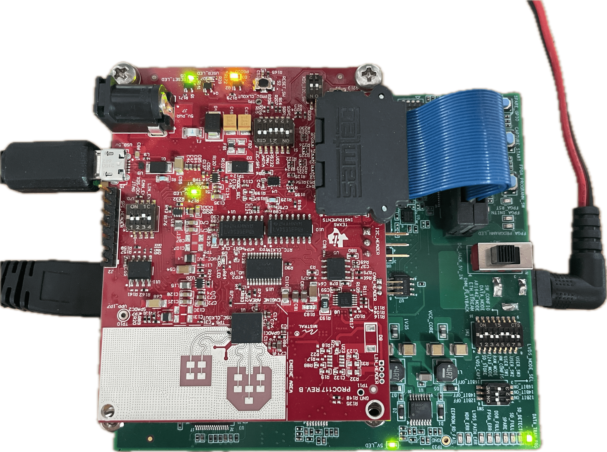

# Real-time ADC Reader for xWRL6432 mmWave Radar via DCA1000

This Python package provides a **standalone** real-time ADC reader for the xWRL6432 mmWave radar sensor using the DCA1000 capture card — no installation of TI’s mmWave Studio required. It is especially useful for:

- Linux users who cannot run mmWave Studio  
- Developers building custom real-time signal-processing pipelines  

> **Note:** Texas Instruments officially supports only recording/playback/visualization via mmWave Studio. This module enables true real-time frame assembly and data access.

> **Don't have a DCA1000 capture card and don't need high data throughput?** Check out [this repo](https://github.com/loeens/mmwave-spi-ftdi-reader) which uses SPI and reads data after the first FFT (1D radar cube).

## Features

- **Radar & DCA1000 Configuration**  
  Send CLI commands to both the xWRL6432 radar EVM and the DCA1000 from Python.  
- **Start/Stop Acquisition**  
  Simple API to begin and end streaming over the DCA1000 UDP interface.  
- **Frame Assembly**  
  - Reorders out-of-order UDP packets  
  - Splits packets that cross frame boundaries  
  - Detects and discards incomplete frames  
- **Queue-based Output**  
  Push each assembled frame into a `queue.Queue` for downstream processing threads.  
- **Batch Recorder**  
  Record a fixed number of frames and either retrieve them in memory or save to a `.npz` file for offline analysis (e.g. in Jupyter Notebooks, example included).  
- **[OpenRadar](https://github.com/PreSenseRadar/OpenRadar) DSP Compatibility**  
  Works seamlessly with the OpenRadar DSP utilities for subsequent processing steps (e.g. range-doppler)

## Installation

1. Clone this repository and enter its directory:
    ```bash
    git clone https://github.com/loeens/xWRL6432-adc-reader.git
    cd xWRL6432-adc-reader
    ```
2. Install the package and its dependencies:
    ```bash
    pip install .
    ```

## Quick Start
### Radar EVM and DCA1000
For setting the switches on the EVM and on the DCA1000, please refer to TI's [DCA1000 mmWave Studio User Guide](https://dev.ti.com/tirex/content/radar_toolbox_2_20_00_05/docs/hardware_guides/dca1000_mmwave_studio_user_guide.html). I have attached an image of my setup here, copy it at your own risk.
- 5V/3A PSU to the DCA1000 via DC barrel jack (realistically draws around 500 mA in my experience)
- Micro USB link between the radar EVM and PC for UART (mmWave CLI) communication and power
- Ethernet cable between PC and DCA1000



- Make sure the IP of your computer is 192.168.33.30 (subnet mask 255.255.255.0 and no gateway). Note: In Ubuntu you can check the box "Use this connection only for resources on its network" in order to be able to still access the internet via wifi.
- Follow [TI's instructions](https://dev.ti.com/tirex/content/radar_toolbox_2_20_00_05/.metadata/Getting_Started_With_xWRL6432.html) to flash the Motion and Presence Detection Demo firmware to the EVM.

### Code
Before running your code, make sure the radar EVM and the DCA1000 are powered on and you meet the prerequisites described in the previous section.
```python
from queue import Queue
from xwrl6432_adc_reader import XWRL6432AdcReader

# 1) Create a thread-safe queue
data_queue = Queue()

# 2) Instantiate the reader
adc_reader = XWRL6432AdcReader(
    radar_serial_port="/dev/ttyACM1",
    radar_cfg_path="radar_config/iwrl6432.cfg",
    out_queue=data_queue
)

# 3) Start streaming in the background
adc_reader.start_acquisition()

# 4) In your processing loop:
try:
    while True:
        frame = data_queue.get()
        # → process your ADC frame here
except KeyboardInterrupt:
    pass

# 5) Clean up
adc_reader.stop_acquisition()
adc_reader.close()
```
A complete example is available in the `examples/` directory.

## Configuration File

The reader expects a TI-style radar configuration file (e.g. iwrl6432.cfg) that you would normally use with mmWave Studio. Place it in a known path and pass it to the constructor, or alternatively use one of the default ones in the `radar_config` directory of this repository.

## Acknowledgements
A big thank you to:
- [**OpenRadar**](https://github.com/PreSenseRadar/OpenRadar): I copied and adapted the DCA1000 interface code from their `adc.py` module. Unfortunately for me there was an issue with their reader function. I fixed it in this repo and created a [pull request in the original repo](https://github.com/PreSenseRadar/OpenRadar/pull/75).
- **Texas Instruments**: For the specification documents and detailed packet-format documentation.